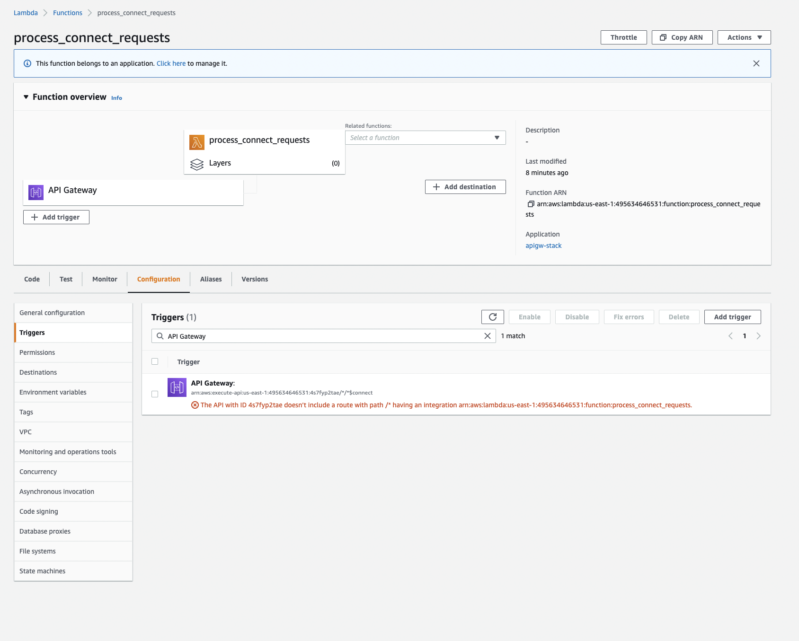

# AWS CDK (v2) apigatewayv2-alpha Lambda trigger console error

Error seen in Lambda console: `The API with ID doesn’t include a route with path /* having an integration.`

Original issue: https://github.com/aws/aws-cdk/issues/19532

## :rocket: Quick Start

**1. Install dependencies with Yarn v1**

```shell
yarn install
```

**2. Build Cloudformation files**

```shell
yarn build
```

**3. Create the [bootstrap stack](https://docs.aws.amazon.com/cdk/latest/guide/bootstrapping.html) in your AWS account**
_This only needs to be ran once per account/region._

```shell
yarn bootstrap
```

**4. Deploy**

```shell
yarn deploy --all
```

**5. View the console Error**

View one of the created Lambda functions in the AWS console. Then open "configuration" > "Triggers" to see the error.


